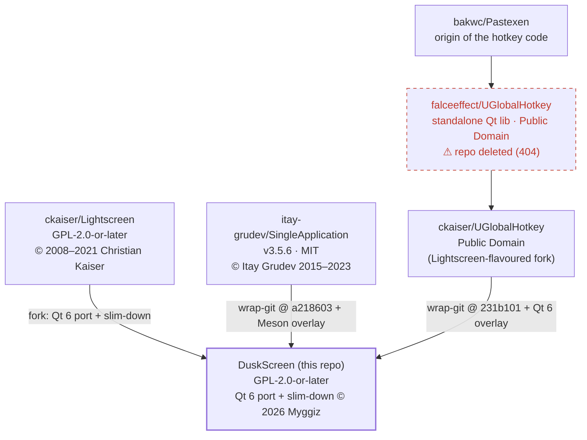

# Provenance

Where DuskScreen and its dependencies come from — the fork lineage, the pinned
upstream revisions, and the local patches carried on top of each.

## Graph

## Components

| Component | Role | Upstream | Pinned revision | License | Local patches |
|---|---|---|---|---|---|
| **DuskScreen** | This application | fork of [ckaiser/Lightscreen](https://github.com/ckaiser/Lightscreen) | — | GPL-2.0-or-later | Qt 6 port, slim-down (see [README](README.md)) |
| **SingleApplication** | Single-instance guard + message forwarding | [itay-grudev/SingleApplication](https://github.com/itay-grudev/SingleApplication) (v3.5.6) | `a218603d76a55dddb65b84f2b49ecaa8efc074ea` | MIT | Meson build overlay only (upstream ships CMake + qmake) |
| **UGlobalHotkey** | System-wide global hotkeys | [ckaiser/UGlobalHotkey](https://github.com/ckaiser/UGlobalHotkey) | `231b10144741b29037f0128bb7a1cd7176529f74` | Public Domain | Qt 6 port (3 files) + Meson build overlay |

Both dependencies are Meson **`wrap-git`** subprojects: the `.wrap` file records the
upstream URL and an immutable commit **SHA** (not a mutable tag/branch), and Meson
fetches the source at `meson setup` time. Our changes live in a
`subprojects/packagefiles/<name>/` **overlay** that Meson copies over the fetched tree —
upstream is never modified in place, so every patch is auditable against the pinned SHA.

## The UGlobalHotkey lineage note

The hotkey code was written by [bakwc](https://github.com/bakwc) and extracted from
[Pastexen](https://github.com/bakwc/Pastexen); **falceeffect** turned it into a
standalone Qt library, but `falceeffect/UGlobalHotkey` **no longer exists (404)**.
[ckaiser](https://github.com/ckaiser) (the Lightscreen author) forked it with code-style
and Windows-support changes. Diffing DuskScreen's previously-vendored copy against
`ckaiser/UGlobalHotkey@231b101` is **byte-identical** except for the Qt 6 port — which
confirms ckaiser is the true, still-live ancestor and the correct wrap source.

## Details

- **SingleApplication** — overlay: [`subprojects/packagefiles/singleapplication/meson.build`](subprojects/packagefiles/singleapplication/meson.build); wrap: [`subprojects/singleapplication.wrap`](subprojects/singleapplication.wrap).
- **UGlobalHotkey** — full patch breakdown: [`subprojects/packagefiles/uglobalhotkey.PROVENANCE.md`](subprojects/packagefiles/uglobalhotkey.PROVENANCE.md); wrap: [`subprojects/uglobalhotkey.wrap`](subprojects/uglobalhotkey.wrap).
